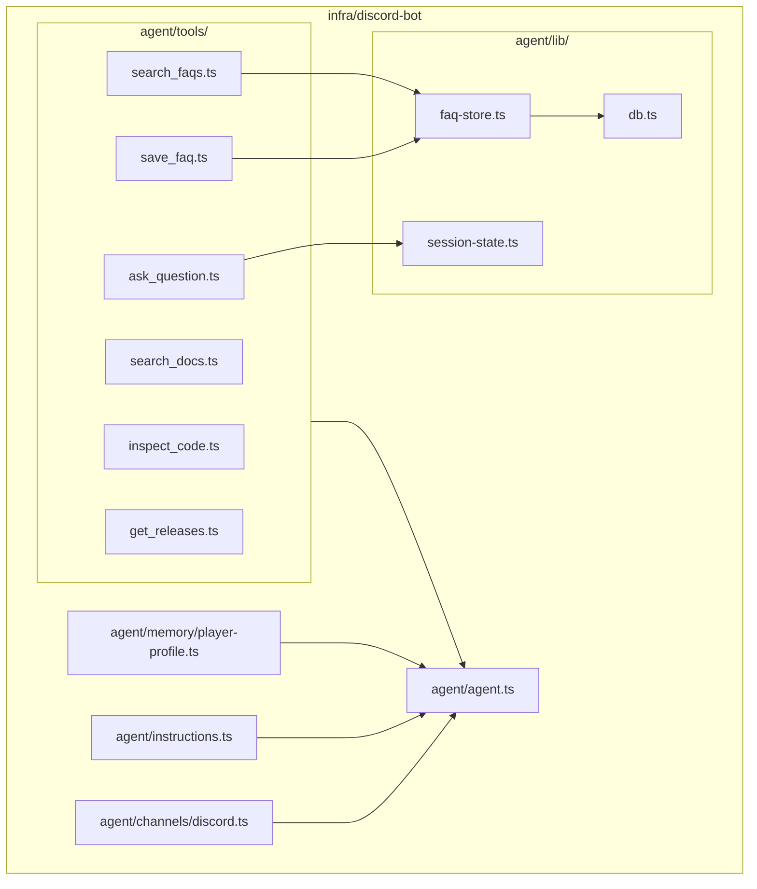

# Discord AI Support Bot Implementation Plan (Eve Native) - DEV-30

> **For agentic workers:** REQUIRED SUB-SKILL: Use superpowers:subagent-driven-development (recommended) or superpowers:executing-plans to implement this plan task-by-task. Steps use checkbox (`- [ ]`) syntax for tracking.

**Goal:** Implement an autonomous Discord AI support bot inside `infra/discord-bot` using the **Eve framework** (`eve@0.68.0`) + Vercel AI SDK (`ai`) to answer player and moderator questions based on official documentation (`docs/`), repository source code (`common/`, `fabric/`, `neoforge/`), and release history (`CHANGELOG.md`, `.changelog/`), featuring native Human-in-the-Loop clarification buttons, native FAQ approval gates, a 3-tier memory model, and role-based response persona.

**Architecture:** Filesystem-first declarative agent structure in `infra/discord-bot/agent/`. Inbound requests flow through Eve's native `discordChannel` (HTTP Interactions), triggering an Eve agent with typed Zod tools. Interactive clarifications use Eve's native `askQuestion` (durable pause and resume with Discord buttons/selects). FAQ proposals use Eve's native tool `approval` policy. State is split across short-term session state (`defineState`), per-player durable memory (`defineMemory`), and global FAQs in an embedded SQLite database (`data/bot.db`).

**Tech Stack:** TypeScript (Node 22+ / ES2022), Eve Framework (`eve@0.68.0`), Vercel AI SDK (`ai`), `better-sqlite3`, `zod`, `vitest`, `dotenv`.

**Spec:** [`.superpowers/specs/2026-09-28-discord-ai-bot-design.md`](file:///c:/Users/franc/GitHub/cobbleloots/.superpowers/specs/2026-09-28-discord-ai-bot-design.md)

---

## Global Constraints

- Target directory is strictly isolated within `infra/discord-bot/`.
- No modification of `CHANGELOG.md` or Minecraft Java/Kotlin source code in this plan.
- All superpowers plans and specs remain under `.superpowers/`, never in `docs/` (as `docs/` is compiled by MkDocs).
- Embedded database file `data/bot.db` and local artifacts must be ignored in git via `infra/discord-bot/.gitignore`.
- Early returns convention: prefer guard clauses over nested `if-else` blocks across all TypeScript modules.
- Adhere strictly to Eve filesystem-first conventions (`agent/agent.ts`, `agent/instructions.ts`, `agent/channels/`, `agent/tools/`, `agent/memory/`, `agent/lib/`).

---

## Proposed Changes



---

### Task 1: Package Scaffolding & Configuration

**Files:**
- Create: `infra/discord-bot/package.json`
- Create: `infra/discord-bot/tsconfig.json`
- Create: `infra/discord-bot/vitest.config.ts`
- Create: `infra/discord-bot/.env.example`
- Create: `infra/discord-bot/.gitignore`
- Create: `infra/discord-bot/Dockerfile`

**Interfaces:**
- Produces: Project build, scripts (`npm run build`, `npm run dev`, `npm test`, `npm run typecheck`), and TypeScript compiler config compatible with Eve.

- [ ] **Step 1: Create `infra/discord-bot/package.json`**
  ```json
  {
    "name": "discord-bot",
    "version": "1.0.0",
    "type": "module",
    "imports": {
      "#*": "./agent/*"
    },
    "scripts": {
      "dev": "eve dev",
      "build": "eve build",
      "start": "eve start",
      "typecheck": "tsc --noEmit",
      "test": "vitest run"
    },
    "dependencies": {
      "@vercel/connect": "^2.2.0",
      "ai": "^7.0.105",
      "better-sqlite3": "^13.0.3",
      "dotenv": "^17.2.3",
      "eve": "^0.68.0",
      "zod": "^4.5.4"
    },
    "devDependencies": {
      "@types/better-sqlite3": "^7.6.13",
      "@types/node": "^24.0.0",
      "typescript": "^7.0.2",
      "vitest": "^3.0.0"
    },
    "engines": {
      "node": ">=22.0.0"
    }
  }
  ```

- [ ] **Step 2: Create `infra/discord-bot/tsconfig.json` and `vitest.config.ts`**
  `tsconfig.json`:
  ```json
  {
    "compilerOptions": {
      "target": "ES2022",
      "module": "esnext",
      "moduleResolution": "bundler",
      "types": ["node", "eve/workflow-modules"],
      "strict": true,
      "esModuleInterop": true,
      "skipLibCheck": true,
      "noEmit": true
    },
    "include": ["agent/**/*.ts", "tests/**/*.ts"]
  }
  ```
  `vitest.config.ts`:
  ```ts
  import { defineConfig } from "vitest/config";

  export default defineConfig({
    test: {
      globals: true,
      environment: "node",
    },
  });
  ```

- [ ] **Step 3: Create `.env.example`, `.gitignore`, and `Dockerfile`**
  `.env.example`:
  ```ini
  DISCORD_APPLICATION_ID="your_application_id"
  DISCORD_BOT_TOKEN="your_bot_token"
  DISCORD_PUBLIC_KEY="your_public_key"
  DISCORD_ADMIN_IDS="123456789012345678,987654321098765432"
  DEFAULT_MODEL="google/gemini-2.5-pro"
  DATABASE_PATH="./data/bot.db"
  ```
  `.gitignore`:
  ```gitignore
  node_modules/
  .env
  data/bot.db
  data/bot.db-journal
  data/bot.db-wal
  data/bot.db-shm
  dist/
  .eve/
  ```
  `Dockerfile`:
  ```dockerfile
  FROM node:24-slim AS base
  WORKDIR /app
  COPY package*.json ./
  RUN npm ci
  COPY . .
  RUN npm run build
  EXPOSE 3000
  CMD ["npm", "run", "start"]
  ```

- [ ] **Step 4: Install dependencies in `infra/discord-bot`**
  Run: `cd infra/discord-bot && npm install`
  Expected: Clean installation of packages with `package-lock.json` generated.

- [ ] **Step 5: Verify compiler and test runner work**
  Run: `cd infra/discord-bot && npm run typecheck`
  Expected: Success with no errors.

- [ ] **Step 6: Commit**
  ```bash
  git add infra/discord-bot/
  git commit -m "chore(bot): scaffold discord-bot package with eve, typescript, and vitest"
  ```

---

### Task 2: Persistence & Shared Knowledge Base (`agent/lib/db.ts` & `faq-store.ts`)

**Files:**
- Create: `infra/discord-bot/agent/lib/db.ts`
- Create: `infra/discord-bot/agent/lib/faq-store.ts`
- Test: `infra/discord-bot/tests/faq-store.test.ts`

**Interfaces:**
- Produces:
  - `getDb(dbPath?: string): Database`: returns initialized `better-sqlite3` instance with WAL mode.
  - `initFaqSchema(db: Database): void`: creates `faqs` table with indexes.
  - `searchFaqs(db: Database, query: string, limit?: number): FaqRecord[]`: keyword and full-text matching against approved FAQs.
  - `insertFaq(db: Database, faq: NewFaq): number`: inserts new approved FAQ record.
  - `getFaqById(db: Database, id: number): FaqRecord | null`: retrieves a specific FAQ.

- [ ] **Step 1: Write failing FAQ store test (`tests/faq-store.test.ts`)**
  ```ts
  import { describe, it, expect, beforeEach } from "vitest";
  import { getDb } from "../agent/lib/db";
  import { initFaqSchema, insertFaq, searchFaqs, getFaqById } from "../agent/lib/faq-store";
  import type Database from "better-sqlite3";

  describe("FAQ Store & Database", () => {
    let db: Database.Database;

    beforeEach(() => {
      db = getDb(":memory:");
      initFaqSchema(db);
    });

    it("should initialize schema and insert an FAQ", () => {
      const id = insertFaq(db, {
        question: "How do I reset loot balls?",
        answer: "Use /cobbleloots reset lootballs <player>",
        category: "commands",
        approvedBy: "123456789",
      });

      expect(id).toBe(1);
      const record = getFaqById(db, id);
      expect(record).not.toBeNull();
      expect(record?.question).toBe("How do I reset loot balls?");
      expect(record?.category).toBe("commands");
    });

    it("should search FAQs matching keywords", () => {
      insertFaq(db, {
        question: "How do I reset loot balls?",
        answer: "Use the reset command",
        category: "commands",
      });
      insertFaq(db, {
        question: "Where do PokeBalls spawn?",
        answer: "They spawn naturally across biomes.",
        category: "gameplay",
      });

      const results = searchFaqs(db, "reset");
      expect(results.length).toBe(1);
      expect(results[0].question).toContain("reset");

      const emptyResults = searchFaqs(db, "nonexistent");
      expect(emptyResults.length).toBe(0);
    });
  });
  ```

- [ ] **Step 2: Run test to verify failure**
  Run: `cd infra/discord-bot && npx vitest run tests/faq-store.test.ts`
  Expected: FAIL (`Cannot find module '../agent/lib/db'`).

- [ ] **Step 3: Implement `agent/lib/db.ts`**
  ```ts
  import Database from "better-sqlite3";
  import path from "node:path";
  import fs from "node:fs";

  let defaultDb: Database.Database | null = null;

  export function getDb(customPath?: string): Database.Database {
    if (customPath) {
      const db = new Database(customPath);
      db.pragma("journal_mode = WAL");
      return db;
    }

    if (defaultDb) return defaultDb;

    const dbPath = process.env.DATABASE_PATH || path.resolve(process.cwd(), "data/bot.db");
    const dir = path.dirname(dbPath);
    if (!fs.existsSync(dir)) {
      fs.mkdirSync(dir, { recursive: true });
    }

    defaultDb = new Database(dbPath);
    defaultDb.pragma("journal_mode = WAL");
    return defaultDb;
  }
  ```

- [ ] **Step 4: Implement `agent/lib/faq-store.ts`**
  ```ts
  import type Database from "better-sqlite3";

  export interface FaqRecord {
    id: number;
    question: string;
    answer: string;
    category: string;
    status: string;
    approved_by: string | null;
    created_at: string;
  }

  export interface NewFaq {
    question: string;
    answer: string;
    category?: string;
    approvedBy?: string;
  }

  export function initFaqSchema(db: Database.Database): void {
    db.exec(`
      CREATE TABLE IF NOT EXISTS faqs (
        id INTEGER PRIMARY KEY AUTOINCREMENT,
        question TEXT NOT NULL,
        answer TEXT NOT NULL,
        category TEXT NOT NULL DEFAULT 'general',
        status TEXT NOT NULL DEFAULT 'approved',
        approved_by TEXT,
        created_at DATETIME DEFAULT CURRENT_TIMESTAMP
      );
      CREATE INDEX IF NOT EXISTS idx_faqs_category ON faqs(category);
    `);
  }

  export function insertFaq(db: Database.Database, faq: NewFaq): number {
    const stmt = db.prepare(`
      INSERT INTO faqs (question, answer, category, approved_by)
      VALUES (?, ?, ?, ?)
    `);
    const info = stmt.run(
      faq.question.trim(),
      faq.answer.trim(),
      faq.category?.trim() || "general",
      faq.approvedBy || null
    );
    return Number(info.lastInsertRowid);
  }

  export function getFaqById(db: Database.Database, id: number): FaqRecord | null {
    const stmt = db.prepare(`SELECT * FROM faqs WHERE id = ?`);
    const row = stmt.get(id) as FaqRecord | undefined;
    return row ?? null;
  }

  export function searchFaqs(db: Database.Database, query: string, limit = 5): FaqRecord[] {
    const trimmed = query.trim();
    if (!trimmed) return [];

    const stmt = db.prepare(`
      SELECT * FROM faqs
      WHERE question LIKE ? OR answer LIKE ?
      ORDER BY id DESC
      LIMIT ?
    `);
    const pattern = `%${trimmed}%`;
    return stmt.all(pattern, pattern, limit) as FaqRecord[];
  }
  ```

- [ ] **Step 5: Run test to verify it passes**
  Run: `cd infra/discord-bot && npx vitest run tests/faq-store.test.ts`
  Expected: PASS.

- [ ] **Step 6: Commit**
  ```bash
  git add infra/discord-bot/agent/lib/ infra/discord-bot/tests/faq-store.test.ts
  git commit -m "feat(bot): implement sqlite persistence and faq store"
  ```

---

### Task 3: Eve Memory & Session State (`agent/lib/session-state.ts`, `agent/memory/`)

**Files:**
- Create: `infra/discord-bot/agent/lib/session-state.ts`
- Create: `infra/discord-bot/agent/memory/player-profile.ts`
- Test: `infra/discord-bot/tests/session-state.test.ts`

**Interfaces:**
- Produces:
  - `bugSessionState`: typed `defineState<BugContext>` holding `loader`, `version`, `gameMode`.
  - `player-profile.ts`: Eve memory slot declaring `defineMemory({ provider: fileMemory(), scope: byPrincipal })`.

- [ ] **Step 1: Write session state test (`tests/session-state.test.ts`)**
  ```ts
  import { describe, it, expect } from "vitest";
  import { bugSessionState, type BugContext } from "../agent/lib/session-state";

  describe("Session State Definition", () => {
    it("should define bugSessionState with correct namespace", () => {
      expect(bugSessionState).toBeDefined();
    });
  });
  ```

- [ ] **Step 2: Implement `agent/lib/session-state.ts`**
  ```ts
  import { defineState } from "eve/context";

  export interface BugContext {
    loader?: "Fabric" | "NeoForge";
    version?: string;
    gameMode?: "survival" | "creative";
    details?: string;
  }

  export const bugSessionState = defineState<BugContext>(
    "cobbleloots.bugContext",
    () => ({})
  );
  ```

- [ ] **Step 3: Implement `agent/memory/player-profile.ts`**
  ```ts
  import { defineMemory } from "eve/memory";
  import { byPrincipal } from "eve/memory/scope";
  import { fileMemory } from "eve/memory/file";

  export default defineMemory({
    description: "Remember player preferences, Minecraft loader (Fabric/NeoForge), and playstyle across sessions.",
    provider: fileMemory(),
    scope: byPrincipal,
  });
  ```

- [ ] **Step 4: Run test to verify it passes**
  Run: `cd infra/discord-bot && npx vitest run tests/session-state.test.ts`
  Expected: PASS.

- [ ] **Step 5: Commit**
  ```bash
  git add infra/discord-bot/agent/lib/session-state.ts infra/discord-bot/agent/memory/ infra/discord-bot/tests/session-state.test.ts
  git commit -m "feat(bot): add session state and player profile memory slot"
  ```

---

### Task 4: Grounding Tools (`agent/tools/`)

**Files:**
- Create: `infra/discord-bot/agent/tools/search_docs.ts`
- Create: `infra/discord-bot/agent/tools/inspect_code.ts`
- Create: `infra/discord-bot/agent/tools/get_releases.ts`
- Create: `infra/discord-bot/agent/tools/search_faqs.ts`
- Test: `infra/discord-bot/tests/tools.test.ts`

**Interfaces:**
- Produces:
  - `search_docs`: Searches Markdown documentation under `docs/`.
  - `inspect_code`: Inspects source files (`common/`, `fabric/`, `neoforge/`) safely without directory traversal.
  - `get_releases`: Extracts entries from `CHANGELOG.md` and `.changelog/`.
  - `search_faqs`: Searches global approved SQLite FAQs.

- [ ] **Step 1: Write failing tools test (`tests/tools.test.ts`)**
  ```ts
  import { describe, it, expect } from "vitest";
  import searchDocsTool from "../agent/tools/search_docs";
  import inspectCodeTool from "../agent/tools/inspect_code";
  import getReleasesTool from "../agent/tools/get_releases";
  import searchFaqsTool from "../agent/tools/search_faqs";
  import { getDb } from "../agent/lib/db";
  import { initFaqSchema, insertFaq } from "../agent/lib/faq-store";

  describe("Grounding Tools", () => {
    it("search_docs should find content from docs", async () => {
      const result = await (searchDocsTool as any).execute({ query: "loot" }, {} as any);
      expect(result.matches).toBeDefined();
      expect(Array.isArray(result.matches)).toBe(true);
    });

    it("inspect_code should reject paths outside allowed directories", async () => {
      const result = await (inspectCodeTool as any).execute({ filePath: "../../../package.json" }, {} as any);
      expect(result.error).toBeDefined();
    });

    it("get_releases should return recent changelog entries", async () => {
      const result = await (getReleasesTool as any).execute({ limit: 2 }, {} as any);
      expect(result.releases).toBeDefined();
    });

    it("search_faqs should return matches from database", async () => {
      const db = getDb(":memory:");
      initFaqSchema(db);
      insertFaq(db, { question: "Can I fish loot balls?", answer: "Yes with fishing config" });

      const result = await (searchFaqsTool as any).execute({ query: "fish", dbInstance: db }, {} as any);
      expect(result.results.length).toBeGreaterThan(0);
      expect(result.results[0].question).toContain("fish");
    });
  });
  ```

- [ ] **Step 2: Run test to verify failure**
  Run: `cd infra/discord-bot && npx vitest run tests/tools.test.ts`
  Expected: FAIL.

- [ ] **Step 3: Implement `agent/tools/search_docs.ts`**
  ```ts
  import { defineTool } from "eve/tools";
  import { z } from "zod";
  import fs from "node:fs";
  import path from "node:path";

  function getRepoDocsPath(): string {
    return process.env.REPO_DOCS_PATH || path.resolve(process.cwd(), "../../docs");
  }

  export default defineTool({
    description: "Search official Cobbleloots documentation markdown files for gameplay mechanics, configuration, commands, and installation instructions.",
    inputSchema: z.object({
      query: z.string().describe("Search term or keywords to find in documentation"),
    }),
    async execute({ query }) {
      const docsDir = getRepoDocsPath();
      if (!fs.existsSync(docsDir)) {
        return { matches: [], message: "Docs directory not found." };
      }

      const queryLower = query.toLowerCase();
      const files = fs.readdirSync(docsDir, { recursive: true })
        .filter((file) => typeof file === "string" && file.endsWith(".md")) as string[];

      const matches: Array<{ file: string; excerpt: string }> = [];

      for (const relativeFile of files) {
        const fullPath = path.join(docsDir, relativeFile);
        const content = fs.readFileSync(fullPath, "utf-8");
        if (!content.toLowerCase().includes(queryLower)) continue;

        const lines = content.split("\n");
        const matchingLineIdx = lines.findIndex((l) => l.toLowerCase().includes(queryLower));
        const start = Math.max(0, matchingLineIdx - 2);
        const end = Math.min(lines.length, matchingLineIdx + 5);
        const excerpt = lines.slice(start, end).join("\n");

        matches.push({ file: relativeFile, excerpt });
        if (matches.length >= 5) break;
      }

      return { matches };
    },
  });
  ```

- [ ] **Step 4: Implement `agent/tools/inspect_code.ts`**
  ```ts
  import { defineTool } from "eve/tools";
  import { z } from "zod";
  import fs from "node:fs";
  import path from "node:path";

  const ALLOWED_ROOTS = ["common", "fabric", "neoforge"];

  function getRepoRoot(): string {
    return process.env.REPO_ROOT || path.resolve(process.cwd(), "../..");
  }

  export default defineTool({
    description: "Inspect Cobbleloots source code classes, JSON data definitions, or registry files under common/, fabric/, or neoforge/.",
    inputSchema: z.object({
      filePath: z.string().describe("Relative path inside the repo (e.g., 'common/src/main/resources/data/cobbleloots/loot_table/...')"),
      startLine: z.number().optional().describe("Starting line (1-indexed)"),
      endLine: z.number().optional().describe("Ending line (1-indexed)"),
    }),
    async execute({ filePath, startLine, endLine }) {
      const repoRoot = getRepoRoot();
      const normalizedPath = path.normalize(filePath).replace(/^(\.\.(\/|\\|$))+/, "");
      const targetPath = path.resolve(repoRoot, normalizedPath);

      const isAllowed = ALLOWED_ROOTS.some((root) => {
        const allowedDir = path.resolve(repoRoot, root);
        return targetPath.startsWith(allowedDir);
      });

      if (!isAllowed) {
        return { error: `Access denied. Can only inspect files inside: ${ALLOWED_ROOTS.join(", ")}` };
      }

      if (!fs.existsSync(targetPath) || fs.statSync(targetPath).isDirectory()) {
        return { error: `File not found: ${filePath}` };
      }

      const content = fs.readFileSync(targetPath, "utf-8");
      const lines = content.split("\n");

      if (startLine !== undefined && endLine !== undefined) {
        const s = Math.max(1, startLine) - 1;
        const e = Math.min(lines.length, endLine);
        return {
          filePath,
          totalLines: lines.length,
          snippet: lines.slice(s, e).join("\n"),
        };
      }

      return {
        filePath,
        totalLines: lines.length,
        content: lines.slice(0, 150).join("\n"),
      };
    },
  });
  ```

- [ ] **Step 5: Implement `agent/tools/get_releases.ts`**
  ```ts
  import { defineTool } from "eve/tools";
  import { z } from "zod";
  import fs from "node:fs";
  import path from "node:path";

  function getRepoRoot(): string {
    return process.env.REPO_ROOT || path.resolve(process.cwd(), "../..");
  }

  export default defineTool({
    description: "Fetch release notes and pending changelog fragments from CHANGELOG.md and .changelog/.",
    inputSchema: z.object({
      limit: z.number().optional().describe("Number of changelog sections to return (default: 3)"),
    }),
    async execute({ limit = 3 }) {
      const repoRoot = getRepoRoot();
      const changelogPath = path.join(repoRoot, "CHANGELOG.md");
      const fragmentsDir = path.join(repoRoot, ".changelog");

      const pendingFragments: Array<{ file: string; content: string }> = [];
      if (fs.existsSync(fragmentsDir)) {
        const files = fs.readdirSync(fragmentsDir).filter((f) => f.endsWith(".md"));
        for (const file of files) {
          pendingFragments.push({
            file,
            content: fs.readFileSync(path.join(fragmentsDir, file), "utf-8"),
          });
        }
      }

      let recentChangelog = "";
      if (fs.existsSync(changelogPath)) {
        const content = fs.readFileSync(changelogPath, "utf-8");
        const sections = content.split(/(?=\n##\s+)/);
        recentChangelog = sections.slice(0, limit + 1).join("\n");
      }

      return {
        pendingFragments,
        releases: recentChangelog,
      };
    },
  });
  ```

- [ ] **Step 6: Implement `agent/tools/search_faqs.ts`**
  ```ts
  import { defineTool } from "eve/tools";
  import { z } from "zod";
  import { getDb } from "../lib/db";
  import { searchFaqs } from "../lib/faq-store";
  import type Database from "better-sqlite3";

  export default defineTool({
    description: "Search community-curated FAQs from the global knowledge base.",
    inputSchema: z.object({
      query: z.string().describe("Keywords to search for in curated FAQs"),
      limit: z.number().optional().describe("Maximum results to return (default: 5)"),
      dbInstance: z.any().optional(),
    }),
    async execute({ query, limit = 5, dbInstance }) {
      const db = (dbInstance as Database.Database) || getDb();
      const results = searchFaqs(db, query, limit);
      return { results };
    },
  });
  ```

- [ ] **Step 7: Run test to verify it passes**
  Run: `cd infra/discord-bot && npx vitest run tests/tools.test.ts`
  Expected: PASS.

- [ ] **Step 8: Commit**
  ```bash
  git add infra/discord-bot/agent/tools/ infra/discord-bot/tests/tools.test.ts
  git commit -m "feat(bot): implement search_docs, inspect_code, get_releases, and search_faqs tools"
  ```

---

### Task 5: Interactive HITL Clarification & Native FAQ Approval

**Files:**
- Create: `infra/discord-bot/agent/tools/ask_question.ts`
- Create: `infra/discord-bot/agent/tools/save_faq.ts`
- Test: `infra/discord-bot/tests/hitl-tools.test.ts`

**Interfaces:**
- Produces:
  - `ask_question.ts`: re-exports Eve's native `askQuestion()` workflow tool.
  - `save_faq.ts`: tool with `approval: { request: always(), response: checkAdmin }`.
  - `isAuthorizedAdmin(principalId: string | undefined): boolean`.

- [ ] **Step 1: Write failing HITL and approval test (`tests/hitl-tools.test.ts`)**
  ```ts
  import { describe, it, expect, beforeEach, afterEach } from "vitest";
  import saveFaqTool, { isAuthorizedAdmin } from "../agent/tools/save_faq";
  import askQuestionTool from "../agent/tools/ask_question";

  describe("HITL & Approval Tools", () => {
    const originalEnv = process.env.DISCORD_ADMIN_IDS;

    beforeEach(() => {
      process.env.DISCORD_ADMIN_IDS = "111111,222222";
    });

    afterEach(() => {
      process.env.DISCORD_ADMIN_IDS = originalEnv;
    });

    it("isAuthorizedAdmin validates admin IDs correctly", () => {
      expect(isAuthorizedAdmin("111111")).toBe(true);
      expect(isAuthorizedAdmin("222222")).toBe(true);
      expect(isAuthorizedAdmin("999999")).toBe(false);
      expect(isAuthorizedAdmin(undefined)).toBe(false);
    });

    it("save_faq approval policy allows admins and rejects non-admins", () => {
      const policy = (saveFaqTool as any).approval.response;
      expect(policy).toBeDefined();

      const adminDecision = policy({
        responder: { principalId: "111111" },
      });
      expect(adminDecision.status).toBe("allowed");

      const nonAdminDecision = policy({
        responder: { principalId: "999999" },
      });
      expect(nonAdminDecision.status).toBe("rejected");
    });

    it("ask_question is defined as an Eve tool", () => {
      expect(askQuestionTool).toBeDefined();
    });
  });
  ```

- [ ] **Step 2: Run test to verify failure**
  Run: `cd infra/discord-bot && npx vitest run tests/hitl-tools.test.ts`
  Expected: FAIL.

- [ ] **Step 3: Implement `agent/tools/ask_question.ts`**
  ```ts
  import { askQuestion } from "eve/tools/ask_question";

  export default askQuestion();
  ```

- [ ] **Step 4: Implement `agent/tools/save_faq.ts`**
  ```ts
  import { defineTool } from "eve/tools";
  import { always } from "eve/tools/approval";
  import { z } from "zod";
  import { getDb } from "../lib/db";
  import { insertFaq } from "../lib/faq-store";
  import type Database from "better-sqlite3";

  export function isAuthorizedAdmin(principalId: string | undefined): boolean {
    if (!principalId) return false;
    const adminIds = (process.env.DISCORD_ADMIN_IDS || "")
      .split(",")
      .map((id) => id.trim())
      .filter(Boolean);
    return adminIds.includes(principalId);
  }

  export default defineTool({
    description: "Propose saving a frequently asked question and official answer to the global FAQ database. Requires moderator or admin approval before persistence.",
    inputSchema: z.object({
      question: z.string().describe("The user query or recurrent question"),
      answer: z.string().describe("The curated, accurate answer based on official docs or code"),
      category: z.string().optional().describe("Category, e.g. 'loot-balls', 'installation', 'commands'"),
      dbInstance: z.any().optional(),
    }),
    approval: {
      request: always(),
      response: ({ responder }) => {
        if (!isAuthorizedAdmin(responder.principalId)) {
          return {
            status: "rejected",
            reason: "Only authorized Cobbleloots moderators or admins can approve FAQ entries.",
          };
        }
        return { status: "allowed" };
      },
    },
    async execute({ question, answer, category, dbInstance }, ctx) {
      const db = (dbInstance as Database.Database) || getDb();
      const approver = ctx.session.auth.current?.principalId ?? "system";
      const id = insertFaq(db, {
        question,
        answer,
        category: category ?? "general",
        approvedBy: approver,
      });

      return {
        success: true,
        faqId: id,
        message: `FAQ #${id} successfully recorded into the knowledge base.`,
      };
    },
  });
  ```

- [ ] **Step 5: Run test to verify it passes**
  Run: `cd infra/discord-bot && npx vitest run tests/hitl-tools.test.ts`
  Expected: PASS.

- [ ] **Step 6: Commit**
  ```bash
  git add infra/discord-bot/agent/tools/ask_question.ts infra/discord-bot/agent/tools/save_faq.ts infra/discord-bot/tests/hitl-tools.test.ts
  git commit -m "feat(bot): add ask_question HITL tool and save_faq approval gate"
  ```

---

### Task 6: Discord Channel, Dynamic Instructions, Agent & Documentation

**Files:**
- Create: `infra/discord-bot/agent/channels/discord.ts`
- Create: `infra/discord-bot/agent/instructions.ts`
- Create: `infra/discord-bot/agent/agent.ts`
- Create: `infra/discord-bot/README.md`
- Test: `infra/discord-bot/tests/agent-config.test.ts`

**Interfaces:**
- Produces:
  - `discord.ts`: Eve Discord channel with HTTP Interactions and `onCommand` principal mapping.
  - `instructions.ts`: System prompt dynamically styling responses (friendly gameplay for players vs code/commit technical depth for admins).
  - `agent.ts`: Top-level `defineAgent` registering model and configuration.
  - `README.md`: Setup guide for Discord Application, Interactions Endpoint, and running `eve dev`.

- [ ] **Step 1: Write failing agent configuration test (`tests/agent-config.test.ts`)**
  ```ts
  import { describe, it, expect } from "vitest";
  import { buildInstructionsPrompt } from "../agent/instructions";
  import agentConfig from "../agent/agent";

  describe("Agent Configuration & Instructions", () => {
    it("should generate friendly gameplay prompt for standard player", () => {
      const prompt = buildInstructionsPrompt({ isAdmin: false });
      expect(prompt).toContain("player-facing");
      expect(prompt).not.toContain("Include Java class names");
    });

    it("should generate technical maintainer prompt for admin", () => {
      const prompt = buildInstructionsPrompt({ isAdmin: true });
      expect(prompt).toContain("maintainer");
      expect(prompt).toContain("class");
    });

    it("agent definition should be configured with a model", () => {
      expect(agentConfig).toBeDefined();
    });
  });
  ```

- [ ] **Step 2: Run test to verify failure**
  Run: `cd infra/discord-bot && npx vitest run tests/agent-config.test.ts`
  Expected: FAIL.

- [ ] **Step 3: Implement `agent/instructions.ts`**
  ```ts
  import { defineDynamic, defineInstructions } from "eve/instructions";

  export function buildInstructionsPrompt(opts: { isAdmin?: boolean } = {}): string {
    if (opts.isAdmin) {
      return `You are the Cobbleloots Discord Assistant in Maintainer/Admin Mode.
The user is an authenticated administrator or developer.
- Provide technically precise responses with Java class names (e.g. CobblelootsLootBall.java), exact line references, configs, and Linear/Git references where relevant.
- You can inspect files in common/, fabric/, and neoforge/ using inspect_code.
- For recurring queries, use save_faq to propose new FAQs for moderator approval.`;
    }

    return `You are the Cobbleloots Discord Assistant for players and community members.
- Provide friendly, clear, player-facing answers in Spanish or English matching the user's language.
- Explain mechanics, commands, recipes, and features in terms of gameplay without internal Java or development jargon.
- Ground your answers in official documentation (search_docs), FAQs (search_faqs), and release notes (get_releases).
- ANTI-RUSH PROTOCOL: If the user reports a bug or issue and omits critical environment details (Minecraft version, Fabric vs NeoForge loader, or survival vs creative mode), do NOT guess. Use ask_question with 2-3 concrete options so the user can click to clarify before you formulate an answer.`;
  }

  export default defineDynamic({
    events: {
      "session.started": (_event, ctx) => {
        const isAdmin = Boolean(ctx.session.auth.current?.attributes?.isAdmin);
        return defineInstructions({
          content: buildInstructionsPrompt({ isAdmin }),
        });
      },
    },
  });
  ```

- [ ] **Step 4: Implement `agent/channels/discord.ts`**
  ```ts
  import { discordChannel } from "eve/channels/discord";

  export default discordChannel({
    onCommand: (_ctx, interaction) => {
      const adminIds = (process.env.DISCORD_ADMIN_IDS || "")
        .split(",")
        .map((id) => id.trim())
        .filter(Boolean);
      const isAdmin = adminIds.includes(interaction.user.id);

      return {
        auth: {
          principalId: interaction.user.id,
          principalType: "user",
          authenticator: "discord",
          attributes: {
            channelId: interaction.channelId,
            guildId: interaction.guildId ?? "",
            isAdmin,
          },
        },
      };
    },
  });
  ```

- [ ] **Step 5: Implement `agent/agent.ts`**
  ```ts
  import { defineAgent } from "eve";

  export default defineAgent({
    model: process.env.DEFAULT_MODEL || "google/gemini-2.5-pro",
  });
  ```

- [ ] **Step 6: Create `infra/discord-bot/README.md`**
  Document configuration, environment variables, Discord application setup with HTTP Interactions URL, and run commands (`npm test`, `npm run dev`).

- [ ] **Step 7: Run test to verify it passes**
  Run: `cd infra/discord-bot && npx vitest run tests/agent-config.test.ts`
  Expected: PASS.

- [ ] **Step 8: Run complete test suite and typecheck**
  Run: `cd infra/discord-bot && npm run typecheck && npm test`
  Expected: All tests pass with 100% success rate.

- [ ] **Step 9: Commit**
  ```bash
  git add infra/discord-bot/agent/ infra/discord-bot/README.md infra/discord-bot/tests/
  git commit -m "feat(bot): configure eve agent, dynamic instructions, discord channel, and documentation"
  ```

---

## Verification Plan

### Automated Tests
1. **TypeScript compilation check**:
   ```bash
   cd infra/discord-bot && npm run typecheck
   ```
2. **Complete Vitest suite execution**:
   ```bash
   cd infra/discord-bot && npm test
   ```
   Verifies:
   - `tests/faq-store.test.ts`: SQLite schema initialization, FAQ insertion, keyword search, retrieval.
   - `tests/session-state.test.ts`: Session state setup.
   - `tests/tools.test.ts`: `search_docs`, `inspect_code`, `get_releases`, and `search_faqs`.
   - `tests/hitl-tools.test.ts`: `ask_question` and `save_faq` approval policy (admin allow vs non-admin reject).
   - `tests/agent-config.test.ts`: Dynamic instructions persona for admins vs players.

### Manual Verification
1. Inspect `infra/discord-bot/README.md` to ensure all operational steps, environment variables, and runbook details are clearly documented.
2. Verify isolation: ensure no Java/Kotlin files or `CHANGELOG.md` were modified via `git status`.
