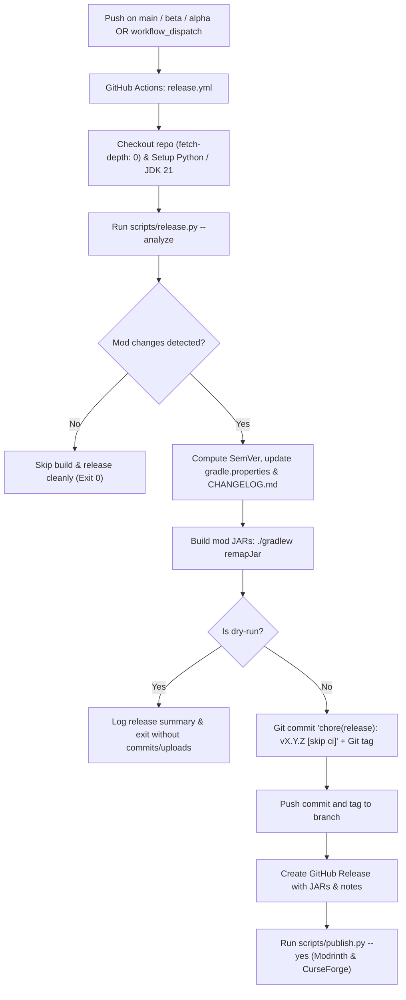

# Design Specification: Automated Semantic Versioning & Multi-Channel Release Workflow

**Issue**: [DEV-7](https://linear.app/ripiodev/issue/DEV-7)  
**Date**: 2026-09-16  
**Status**: Draft / Pending Approval  

---

## 1. Context & Objectives

Currently, mod versioning and external platform publishing in Cobbleloots are performed manually through direct edits to `gradle.properties`, manual updates to `CHANGELOG.md`, and local interactive execution of `scripts/publish.py`.

The goal of this design is to fully automate the release lifecycle via GitHub Actions by adopting industry standard practices (SemVer 2.0.0 derived from Conventional Commits) with multi-channel support:
- `main` branch: Stable releases (`X.Y.Z`).
- `beta` branch: Beta pre-releases (`X.Y.Z-beta.N`).
- `alpha` branch: Alpha pre-releases (`X.Y.Z-alpha.N`).

The workflow will automatically update `gradle.properties` and `CHANGELOG.md`, build JAR artifacts using an explicit naming convention (`cobbleloots-<loader>-<minecraft_version>-<mod_version>.jar`), create GitHub Releases with compiled artifacts and release notes, and distribute versions to Modrinth and CurseForge with corresponding Minecraft 1.21.1 and Cobblemon 1.7.x metadata.

---

## 2. Architecture & Workflow Overview



---

## 3. Detailed Component Specifications

### 3.1. JAR Artifact Naming Convention (`build.gradle`)

The final JARs distributed to players must clearly indicate the Minecraft version they target.

In [`build.gradle`](file:///build.gradle), configure `archivesName` across all subprojects:
```groovy
subprojects {
    base {
        archivesName = "$rootProject.archives_name-$project.name-$rootProject.minecraft_version"
    }
}
```
When `./gradlew remapJar` runs, this produces:
- Fabric: `fabric/build/libs/cobbleloots-fabric-1.21.1-<mod_version>.jar`
- NeoForge: `neoforge/build/libs/cobbleloots-neoforge-1.21.1-<mod_version>.jar`

---

### 3.2. Semantic Versioning Engine (`scripts/release.py`)

A standalone CLI written in Python (using standard library, `typer`, and `rich`) that analyzes commits, computes version bumps, generates release notes, and updates repository metadata.

#### 3.2.1. Baseline Version Resolution
- Checks Git for existing tags matching `v*.*.*` via `git describe --tags --abbrev=0` or `git tag -l "v*"`.
- If no Git tags exist (e.g. initial automation run), falls back to `mod_version` defined in [`gradle.properties`](file:///gradle.properties) (baseline `2.3.0`).

#### 3.2.2. Hybrid Commit Filtering (Path + Scope Filtering)
To ensure repository infrastructure/tooling commits (e.g., `.agents/`, `.github/`, `scripts/`, `relay/`) do not falsely trigger mod releases:

1. **Path-based Gate**:
   Inspect files changed per commit (`git log --name-only`):
   - **Mod Paths**: `common/**`, `fabric/**`, `neoforge/**`, `build.gradle`, `settings.gradle`, or dependency bumps in `gradle.properties`.
   - **Repo/Tooling Paths**: `.agents/**`, `.github/**`, `scripts/**`, `docs/**`, `relay/**`, `package*.json`, `tsconfig.json`, `wrangler.toml`, `*.md`, `.gitignore`.
   - **Rule**: If a commit modifies *only* repo/tooling paths, it is discarded from release consideration.

2. **Scope Filtering**:
   - Tooling scopes: `(mcp)`, `(relay)`, `(agents)`, `(factory)`, `(harness)`, `(templates)`, `(ci)`, `(github)`, `(scripts)`, `(release)`, `(docs)`.
   - Mod scopes: `(lootball)`, `(commands)`, `(fishing)`, `(config)`, `(fabric)`, `(neoforge)`, `(common)` or unscoped commits modifying mod paths.

3. **Bump Rule**:
   - `BREAKING CHANGE:` in body or `!` in commit type (e.g., `feat!:`) touching mod code $\rightarrow$ **MAJOR** bump.
   - `feat:` or `feat(...):` touching mod code $\rightarrow$ **MINOR** bump.
   - `fix:` or `fix(...):` touching mod code $\rightarrow$ **PATCH** bump.
   - If no qualifying commits exist $\rightarrow$ Set `has_release=false` and exit cleanly.

#### 3.2.3. Multi-Channel & Pre-Release Counter Calculation
- **`main` Branch**:
  - Target channel: `release`.
  - Version: Clean SemVer `X.Y.Z`.
  - Tag: `vX.Y.Z`.
  - Graduation rule: If preceding work in this release cycle was pre-released (e.g., `v2.4.0-beta.2`), merging to `main` graduates to `v2.4.0`.
- **`beta` Branch**:
  - Target channel: `beta`.
  - Suffix: `-beta.N`.
  - Number calculation: Inspect existing tags matching `vX.Y.Z-beta.*`. If `vX.Y.Z-beta.M` exists, set `N = M + 1`. If none, `N = 1`.
  - Tag: `vX.Y.Z-beta.N`.
- **`alpha` Branch**:
  - Target channel: `alpha`.
  - Suffix: `-alpha.N`.
  - Same increment rule: `vX.Y.Z-alpha.N`.

#### 3.2.4. File Updates
- **[`gradle.properties`](file:///gradle.properties)**: Updates `mod_version=<calculated_version>` and `mod_version_type=<channel>`.
- **[`CHANGELOG.md`](file:///CHANGELOG.md)**: Generates a new release section prepended below the header:
  ```markdown
  ## <mod_version>

  ### Features
  - <feat commits>

  ### Bug Fixes
  - <fix commits>

  ### Technical Changes
  - <refactor / perf / internal mod changes>
  ```
- **Release Notes Artifact**: Writes the isolated Markdown snippet for this release to `.release_notes.md` for use by GitHub Releases and mod platforms.

#### 3.2.5. CI Outputs & Dry-Run Support
- Flags: `--dry-run`, `--branch <branch_name>`.
- Writes key-value pairs to `$GITHUB_OUTPUT`:
  - `has_release=true|false`
  - `mod_version=<version>`
  - `mod_version_type=<channel>`
  - `tag=v<version>`
  - `is_prerelease=true|false`
  - `minecraft_version=<mc_version>`
  - `notes_file=.release_notes.md`

---

### 3.3. Publishing Script & Tooling Adaptations (`scripts/`)

#### 3.3.1. Headless CI Support in `scripts/publish.py`
- Add `--yes` / `-y` flag to `build` and `publish` commands.
- Automatically detect `CI=true` or `GITHUB_ACTIONS=true` in environment: when true or `--yes` is passed, bypass all `typer.confirm()` prompts.

#### 3.3.2. Dynamic Artifact Path Resolution
Update file resolution in `publish.py` to match the new `archivesName` pattern:
```python
fabric_path = ROOT_PATH / "fabric" / "build" / "libs" / f"{mod_properties.mod_id}-fabric-{mod_properties.minecraft_version}-{mod_properties.mod_version}.jar"
neoforge_path = ROOT_PATH / "neoforge" / "build" / "libs" / f"{mod_properties.mod_id}-neoforge-{mod_properties.minecraft_version}-{mod_properties.mod_version}.jar"
```

#### 3.3.3. Platform Display Names & Channel Metadata
- **Display Names**:
  - GitHub Release: `Cobbleloots v<mod_version> [<minecraft_version>]`
  - Modrinth Fabric: `Cobbleloots v<mod_version> [<minecraft_version>] [Fabric]`
  - Modrinth NeoForge: `Cobbleloots v<mod_version> [<minecraft_version>] [NeoForge]`
  - CurseForge Fabric: `Cobbleloots v<mod_version> [<minecraft_version>] [Fabric]`
  - CurseForge NeoForge: `Cobbleloots v<mod_version> [<minecraft_version>] [NeoForge]`
- **Modrinth Metadata**:
  - `"version_type": mod_properties.mod_version_type` (`"release"`, `"beta"`, or `"alpha"`).
  - `"featured": (mod_properties.mod_version_type == "release")`.
  - Injected dependencies: Cobblemon `1.7.x` (`MdwFAVRL`), Fabric API for Fabric (`P7dR8mSH`).
- **CurseForge Metadata**:
  - `"releaseType": mod_properties.mod_version_type`.
  - Injected relations: Cobblemon (687131), Fabric API for Fabric (306612).

#### 3.3.4. Robust Environment Resolution
- **[`scripts/config.py`](file:///scripts/config.py)**: In `load_env()`, do not raise `FileNotFoundError` if `.env` does not exist. Read existing process environment variables (`os.environ`) in CI.
- **[`scripts/models.py`](file:///scripts/models.py)**: Add `model_config = ConfigDict(extra="ignore")` to `ModProperties` so unlisted `gradle.properties` entries do not fail parsing.

---

### 3.4. GitHub Actions Release Workflow (`.github/workflows/release.yml`)

#### 3.4.1. Workflow Triggers & Permissions
```yaml
name: Release Automation

on:
  push:
    branches:
      - main
      - beta
      - alpha
  workflow_dispatch:
    inputs:
      dry_run:
        description: "Dry-run mode (verify build and calculation without committing or publishing)"
        required: false
        type: boolean
        default: false

permissions:
  contents: write
```

#### 3.4.2. Execution Steps
1. **Checkout**: `actions/checkout@v4` with `fetch-depth: 0`.
2. **Setup Runtimes**:
   - `actions/setup-java@v4` with `java-version: '21'` (distribution: `'temurin'`).
   - `actions/setup-python@v5` with `python-version: '3.12'`.
3. **Install Dependencies**: `pip install -r scripts/requirements.txt`.
4. **Configure Git**:
   ```bash
   git config user.name "github-actions[bot]"
   git config user.email "41898282+github-actions[bot]@users.noreply.github.com"
   ```
5. **Run Semantic Versioning Analysis**:
   ```bash
   python scripts/release.py --branch ${{ github.ref_name }} ${{ inputs.dry_run && '--dry-run' || '' }}
   ```
6. **Guard Check**: If `steps.versioning.outputs.has_release != 'true'`, print notice and exit cleanly.
7. **Compile JARs**: `./gradlew remapJar --stacktrace`.
8. **Dry-Run Check**: If `inputs.dry_run == true`, summarize outputs and exit.
9. **Commit & Tag**:
   ```bash
   git add gradle.properties CHANGELOG.md
   git commit -m "chore(release): ${{ steps.versioning.outputs.tag }} [skip ci]"
   git tag -a "${{ steps.versioning.outputs.tag }}" -m "Release ${{ steps.versioning.outputs.tag }}"
   git push origin ${{ github.ref_name }} --tags
   ```
   *Auth*: Uses `${{ secrets.RELEASE_TOKEN || secrets.GITHUB_TOKEN }}`.
10. **GitHub Release**:
    ```bash
    gh release create "${{ steps.versioning.outputs.tag }}" \
      --title "Cobbleloots ${{ steps.versioning.outputs.tag }} [${{ steps.versioning.outputs.minecraft_version }}]" \
      --notes-file ".release_notes.md" \
      ${{ steps.versioning.outputs.is_prerelease == 'true' && '--prerelease' || '' }} \
      fabric/build/libs/*.jar neoforge/build/libs/*.jar
    ```
11. **External Publishing**:
    Validate `MODRINTH_TOKEN` and `CURSEFORGE_TOKEN` presence.
    Run `python scripts/publish.py publish --yes`.

---

## 4. Error Handling & Safety Guardrails

1. **Loop Prevention**: Release commits include `[skip ci]` to prevent triggering recurrent workflows.
2. **Missing Secrets Validation**: If `MODRINTH_TOKEN` or `CURSEFORGE_TOKEN` is missing during a real release, fail immediately with an explicit error before partial publishing.
3. **Repository Cleanliness**: The changelog update strictly adheres to the rule in `AGENTS.md` (no manual edits in feature PRs; only centralized automated release updates).
4. **Memory Constraint**: Gradle commands use `GRADLE_OPTS: "-Dorg.gradle.jvmargs=-Xmx5g -Dorg.gradle.daemon=false -Dorg.gradle.parallel=false"` to prevent runner OOM errors.

---

## 5. Verification Plan

1. **Local Syntax & Unit Checks**:
   - Test `scripts/release.py` with `--dry-run` against the existing commit history.
   - Verify that all repo/tooling commits are filtered out and `has_release=false` is reported.
   - Test synthetic commits touching `common/` to verify PATCH, MINOR, and MAJOR increments and pre-release `-beta.1` tags.
2. **Build Verification**:
   - Run `./gradlew remapJar` to verify JAR filenames match `cobbleloots-<loader>-1.21.1-<mod_version>.jar`.
3. **Publishing Dry-Run**:
   - Run `python scripts/publish.py --help` and verify `--yes` flag.
   - Verify `scripts/config.py` runs without `.env` present.
4. **CI Workflow Verification**:
   - Validate YAML syntax of `.github/workflows/release.yml`.
