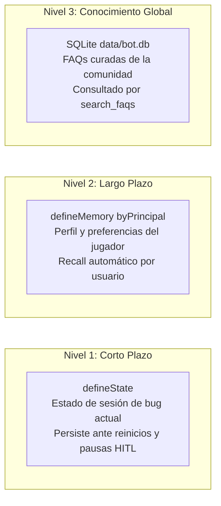

# Especificación de Diseño: Discord AI Support Bot (Eve Framework)

**Fecha:** 2026-09-29  
**Ubicación:** `infra/discord-bot/`  
**Framework:** [Eve (`eve.dev`)](https://eve.dev) v0.68.0 + Vercel AI SDK (`ai`)  
**Estado:** Aprobado por el usuario  

---

## 1. Visión General y Objetivos

El **Discord AI Support Bot** de Cobbleloots es un agente autónomo de soporte técnico e información comunitaria diseñado para operar en el servidor de Discord oficial mediante el framework nativo **Eve**.

### Objetivos Clave
1. **Comprensión contextual profunda**: Responder preguntas sobre mecánicas de juego, configuración, instalación, solución de problemas y comandos, cruzando la documentación oficial (`docs/`), el código fuente (`common/`, `fabric/`, `neoforge/`) y el historial de cambios y releases (`CHANGELOG.md`, `.changelog/`).
2. **Protocolo de Aclaración Anti-Apresuramiento con HITL Nativo**: Detectar ambigüedades en consultas de reporte de bugs (falta de versión, loader o modo de juego) y pausar la ejecución usando el Human-in-the-Loop nativo de Eve (`askQuestion`). Eve renderiza automáticamente botones o select menus en Discord y reanuda el turno al responder el usuario.
3. **Gestión y Aprendizaje de FAQs con Aprobación Nativa**: Detectar consultas recurrentes resueltas con alta certeza, proponerlas como candidatas a FAQ mediante `save_faq` con política de aprobación nativa (`approval: { request: always(), response: checkAdmin }`). Solo los administradores/moderadores pueden autorizar su ingreso a la base de datos de FAQs.
4. **Distinción de Roles (Admin/Mod vs Jugador)**: Reconocer a administradores y moderadores mediante `session.auth` (`principalId` y roles). A los jugadores se les responde en lenguaje natural de gameplay y soporte; a los administradores se les otorgan referencias a nivel de código, commits y comandos de diagnóstico.
5. **Arquitectura Filesystem-First**: Implementado siguiendo la convención declarativa canónica de Eve en `infra/discord-bot/agent/` (`agent.ts`, `instructions.ts`, `channels/`, `tools/`, `memory/`, `lib/`).

---

## 2. Arquitectura del Sistema

```mermaid
flowchart TD
    User([Usuario en Discord]) -->|Slash Command /ask o Interacción| EveDiscord[Eve discordChannel: HTTP Interactions]
    EveDiscord --> AuthResolution[Resolución de Auth & Roles en onCommand]
    AuthResolution --> SessionContext[Sesión Durable de Eve]

    SessionContext --> ClarifyCheck{¿Falta información crítica del bug?}
    ClarifyCheck -->|Sí: Bug sin loader/versión| HitlTool[tool: ask_question]
    HitlTool -->|input.requested| DiscordButtons[Componentes UI Discord: Botones/Selects]
    DiscordButtons -->|Respuesta del Jugador| HitlResume[Reanudación Automática de Sesión]
    HitlResume --> SessionContext

    ClarifyCheck -->|No: Consulta Completa| ToolOrchestrator[Orquestador de Herramientas de Eve]

    ToolOrchestrator --> ToolFAQ[tool: search_faqs]
    ToolOrchestrator --> ToolDocs[tool: search_docs]
    ToolOrchestrator --> ToolCode[tool: inspect_code]
    ToolOrchestrator --> ToolReleases[tool: get_releases]

    ToolFAQ --> FAQStore[(Base de FAQs Global: SQLite data/bot.db)]
    ToolDocs --> DocsFiles[Lectura directa de docs/*.md]
    ToolCode --> CodeFiles[Lectura de common/, fabric/, neoforge/]
    ToolReleases --> GitFiles[CHANGELOG.md + .changelog/]

    ToolOrchestrator --> LLMResponse[Generación de Respuesta contextualizada]

    LLMResponse --> FAQCheck{¿Respuesta candidata a nueva FAQ?}
    FAQCheck -->|Sí| ToolSaveFAQ[tool: save_faq con approval gate]
    ToolSaveFAQ -->|tool-approval request| ModPrompt[Botones [Approve] / [Reject] en Discord]
    ModPrompt -->|Aprobado por Admin| FAQStore
```

---

## 3. Modelo de Almacenamiento y Memoria (3 Niveles en Eve)

El almacenamiento se organiza en tres niveles con responsabilidades y ciclos de vida independientes:



1. **Nivel 1: Estado de Sesión a Corto Plazo (`defineState`)**
   - Declarado en `agent/lib/session-state.ts` con `defineState("cobbleloots.bugContext", ...)`.
   - Duradero durante la sesión: sobrevive a pausas por preguntas HITL o reinicios del proceso.
   - Guarda el loader detectado (`Fabric` / `NeoForge`), versión y modo de juego de la consulta activa.
2. **Nivel 2: Memoria a Largo Plazo por Usuario (`defineMemory`)**
   - Declarado en `agent/memory/player-profile.ts` con `scope: byPrincipal`.
   - Utiliza `fileMemory()` nativo de Eve.
   - Eve inyecta automáticamente al inicio de cada turno (`turn.started`) las preferencias recordadas del usuario (ej. *"este usuario siempre juega en Fabric 1.21.1 singleplayer"*), evitando preguntas redundantes en futuras sesiones.
3. **Nivel 3: Base de Conocimiento Global de FAQs (Persistencia SQLite)**
   - Almacenado en `data/bot.db` (SQLite en modo WAL).
   - Recurso compartido por todo el servidor.
   - Alimentado mediante `save_faq` (con compuerta de aprobación de moderadores) y consultado por `search_faqs`.

---

## 4. Estructura Canónica de Archivos (`infra/discord-bot/`)

```text
infra/discord-bot/
├── agent/
│   ├── agent.ts                 # defineAgent({ model: 'google/gemini-2.5-pro', ... })
│   ├── instructions.ts          # Prompt del sistema dinámico (detecta admin vs jugador vía session.auth)
│   ├── channels/
│   │   └── discord.ts           # discordChannel de Eve con HTTP Interactions
│   ├── memory/
│   │   └── player-profile.ts    # defineMemory con scope byPrincipal
│   ├── lib/
│   │   ├── session-state.ts     # defineState para contexto de sesión
│   │   └── db.ts                # Conexión SQLite better-sqlite3 para FAQs globales
│   └── tools/
│       ├── ask_question.ts      # export default askQuestion() (HITL nativo)
│       ├── search_docs.ts       # Búsqueda semántica/keyword en docs/*.md
│       ├── inspect_code.ts      # Inspección dirigida en common/, fabric/, neoforge/
│       ├── get_releases.ts      # Lectura de CHANGELOG.md y fragmentos .changelog/
│       ├── search_faqs.ts       # Consulta a base de FAQs curadas
│       └── save_faq.ts          # Propuesta de FAQ con approval policy nativa de Eve
├── data/
│   ├── bot.db                   # Base de datos SQLite (ignorado en git)
│   └── .gitkeep
├── package.json                 # eve, ai, better-sqlite3, zod
├── tsconfig.json
└── README.md                    # Runbook de configuración de Discord Application & Vercel Connect
```

---

## 5. Protocolo de Aclaración Anti-Apresuramiento (HITL)

Cuando un jugador formula una consulta con síntomas de falla o dudas de comportamiento (ej: *"no puedo romper la bola"*, *"el mod no carga"*):

1. **Evaluación de Completitud**:
   El agente evalúa si cuenta con los metadatos necesarios:
   - Loader en uso (`Fabric` o `NeoForge`).
   - Versión de Cobbleloots.
   - Modo de juego (`Supervivencia` vs `Creativo`).
2. **Intervención Interactiva**:
   Si falta contexto crucial, el agente llama a `ask_question`:
   - `question`: Breve pregunta aclaratoria explicando por qué es necesario saberlo.
   - `options`: Opciones concretas (`Fabric 1.21.1`, `NeoForge 1.21.1`, etc.).
   - Eve pausa el turno en `session.waiting`, envía los botones a Discord y, tras el click del jugador, reanuda el turno con `{ status: "answered", answer: "Fabric 1.21.1" }`.

---

## 6. Curación de FAQs con Aprobación Nativa

1. **Detección**:
   Cuando el bot genera una respuesta concluyente con alta confianza basada en la documentación oficial, evalúa si representa una duda recurrente de alto valor.
2. **Llamada a Herramienta**:
   Invoca `save_faq({ question, answer, category })`.
3. **Approval Gate de Eve**:
   La política `approval` de `save_faq` intercepta la llamada:
   - Requiere aprobación obligatoria (`request: always()`).
   - La respuesta valida que el autor del click sea un administrador (`response: ({ responder }) => isMod(responder)`).
   - Eve genera automáticamente los botones de aprobación en Discord.
   - Si se aprueba, `save_faq` ejecuta la inserción en `data/bot.db` y queda disponible para futuras consultas.

---

## 7. Distinción de Roles (Admin vs Jugador)

El canal `discordChannel` inyecta la identidad en `session.auth`:
- **Modo Jugador**:
  - Tono cálido, amigable y explicativo en términos de gameplay.
  - Guía paso a paso sin jerga técnica interna de Java.
- **Modo Admin / Moderador**:
  - Habilitación de referencias a clases exactas (`CobblelootsLootBall.java`), números de línea, PRs o commits de Linear (`DEV-5`), y métodos relevantes.
  - Respuestas concisas orientadas a debugging y mantenimiento.

---

## 8. Variables de Entorno (`.env`)

```ini
# Discord Credentials (HTTP Interactions)
DISCORD_APPLICATION_ID="tu-application-id"
DISCORD_BOT_TOKEN="tu-bot-token"
DISCORD_PUBLIC_KEY="tu-public-key"

# Permisos y Moderación
DISCORD_ADMIN_IDS="123456789012345678,987654321098765432"

# LLM Providers (Vercel AI SDK)
GOOGLE_GENERATIVE_AI_API_KEY="" # o OPENAI_API_KEY="" / ANTHROPIC_API_KEY=""
DEFAULT_MODEL="google/gemini-2.5-pro"

# Storage
DATABASE_PATH="./data/bot.db"
```
