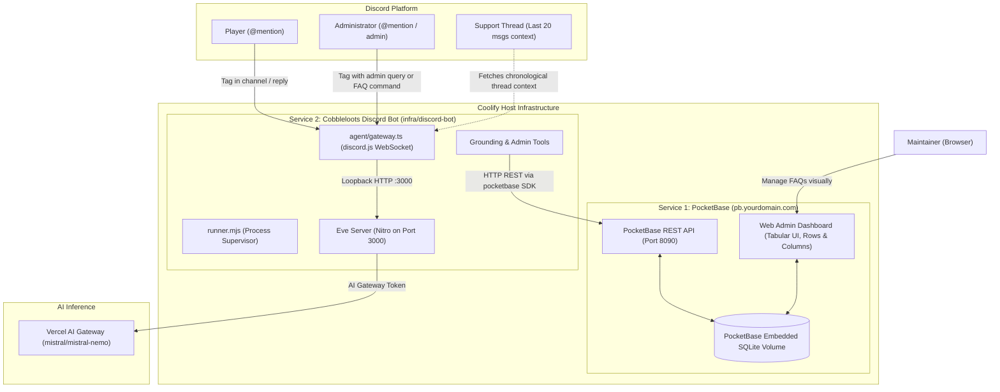

# Technical Specification: Decoupled Discord AI Support Bot with PocketBase & pnpm

**Date:** 2026-10-02  
**Issue:** [DEV-30] [Cobbleloots] Implementar bot de soporte de Discord con Eve Framework  
**Status:** DRAFT (Awaiting User Review)  
**Target Subproject:** `infra/discord-bot/`  

---

## 1. Executive Summary & Retrospective

The Cobbleloots Discord AI Support Bot provides autonomous, grounded gameplay and technical support to the Cobbleloots community. In previous iterations, embedded SQLite persistence (`better-sqlite3`) caused cascading deployment failures inside Docker on Coolify:
- Lifecycle install scripts blocked by npm 11 security (`allowScripts`).
- Unbundled native `.node` bindings in Nitro's bundled output (`.output/server/_chunks/node-server.mjs`).
- Docker host volume mounts owned by `root:root` throwing `SQLITE_CANTOPEN` when running as `USER node`.
- Module-level eager database connections crashing the container before boot.

This specification completely re-architects the service by **decoupling persistent storage into PocketBase** (hosted as an independent microservice in Coolify with its own Web Admin UI), adopting **`pnpm`** as the package manager, leveraging **Discord thread history** for conversational context, and enforcing **English as the default language with fluent Spanish support**.

---

## 2. Architecture & Service Topology



### Architectural Principles:
1. **100% Stateless Bot Container:** The Discord bot has **zero local databases**, zero volume permissions dependencies, and zero native C++ compilation modules.
2. **Pure `pnpm` Lifecycle:** Fast, secure, content-addressable dependency management using Corepack / `pnpm`.
3. **Decoupled Admin Experience:** The maintainer can inspect and edit FAQ records visually through PocketBase's web panel or interactively via Discord chat.
4. **Thread-Aware Context:** Thread messages are retrieved on-the-fly and supplied to the session context, avoiding repetitive user questioning.

---

## 3. Package Management & Dependencies (`pnpm`)

The bot project strictly uses `pnpm@11.x`.

### `package.json`
```json
{
  "name": "discord-bot",
  "version": "1.0.0",
  "type": "module",
  "packageManager": "pnpm@11.20.0",
  "imports": {
    "#*": "./agent/*"
  },
  "scripts": {
    "dev": "eve dev",
    "build": "eve build",
    "start": "node runner.mjs",
    "typecheck": "tsc --noEmit",
    "test": "vitest run"
  },
  "dependencies": {
    "@vercel/connect": "^2.2.0",
    "ai": "^7.0.105",
    "discord.js": "^14.27.0",
    "dotenv": "^17.2.3",
    "eve": "^0.68.0",
    "pocketbase": "^0.26.0",
    "zod": "^4.5.4"
  },
  "devDependencies": {
    "@types/node": "^24.0.0",
    "typescript": "^7.0.2",
    "vitest": "^3.0.0"
  },
  "engines": {
    "node": ">=22.0.0"
  }
}
```

*Note: `better-sqlite3` and its types are completely removed from dependencies.*

---

## 4. PocketBase Schema & Bot Integration

### 4.1 Collection: `faqs`

| Field | Type | Required | Description |
| :--- | :--- | :--- | :--- |
| `id` | `text` (Auto 15 chars) | Yes | Unique record identifier generated by PocketBase. |
| `question` | `text` | Yes | Common question phrasing (e.g. *"Do Loot Balls respawn?"*). |
| `answer` | `text` (Markdown) | Yes | Comprehensive player-facing answer with commands and formatting. |
| `keywords` | `text` | No | Comma-separated search terms for fast retrieval. |
| `category` | `select` / `text` | Yes | Category: `Mechanics`, `Commands`, `Configuration`, `Troubleshooting`. |
| `created_by` | `text` | No | Discord tag or ID of creator. |

### 4.2 Bot Client & Bootstrap (`agent/lib/pb.ts`)
- Client singleton initialized with `new PocketBase(process.env.POCKETBASE_URL || 'http://127.0.0.1:8090')`.
- On boot, `ensurePocketBaseAuth()` authenticates via `pb.collection('_superusers').authWithPassword(email, password)` (or `pb.admins.authWithPassword` depending on PB version).
- Auto-bootstrap: Checks if collection `faqs` exists; if not, creates the collection schema automatically.
- Graceful degradation: If PocketBase is temporarily unavailable, logging warns without killing the bot.

---

## 5. Interaction Model & Thread Context Engine

### 5.1 Trigger Mechanics (`agent/gateway.ts`)
The bot triggers only when:
1. Explicitly mentioned (`<@botId>`).
2. Replied to (`message.reference?.messageId` pointing to a bot message).
3. Ignores other bots (`message.author.bot === true`).

### 5.2 Thread History Ingestion
When `message.channel.isThread()`:
- Calls `message.channel.messages.fetch({ limit: 20 })`.
- Sorts messages chronologically (oldest to newest).
- Formats transcript:
  ```text
  [Thread History - #<thread-name>]
  <AuthorA>: I broke a master loot ball in the desert.
  <AuthorB>: What Minecraft version and loader are you on?
  <AuthorA>: Minecraft 1.21.1 on NeoForge 21.1.182.
  <AuthorA>: @Cobbleloots Assistant is there any config to reset them?
  ```
- Prepends transcript to the session message. The AI model detects prior context and skips asking for already provided information.

### 5.3 Message Splitting & Typing Indicator
- Keeps typing indicator refreshed (`sendTyping()`) every 7 seconds while generating.
- Splits messages exceeding 1900 characters cleanly on paragraph boundaries (`\n\n`) or sentence boundaries.

---

## 6. Language & Prompt Engineering (`agent/instructions.ts`)

### 6.1 Language Policy
- **Default Language:** English.
- **Multilingual Support:** If the user initiates or writes in Spanish, the assistant responds in natural, friendly Spanish, while preserving exact Minecraft command syntax (`/cobbleloots ...`), item identifiers, and technical terms.
- All default fallback errors, greetings, and presence status are in English.

### 6.2 Role Differentiation
- **Players:** Friendly, gameplay-oriented explanations grounded in documentation and FAQs.
- **Maintainers / Admins (`isAuthorizedAdmin`):** Technical precision with Java class references (`CobblelootsLootBall.java`), mixins, event hooks, and direct code inspection.
- **Anti-Rush Protocol:** If a bug report lacks critical environment details (Minecraft version, Fabric vs NeoForge loader), the bot invokes `ask_question` with 2-3 concrete options before formulating a diagnosis.

---

## 7. Grounding & Management Tools

| Tool | Authorized To | Description |
| :--- | :--- | :--- |
| `search_docs` | All | Searches markdown documentation in `docs/`. |
| `search_faqs` | All | Queries PocketBase `faqs` collection for matching terms. |
| `get_releases`| All | Fetches releases and changelog from GitHub API. |
| `inspect_code`| All | Inspects repository code in `common/`, `fabric/`, `neoforge/` with strict path confinement. |
| `ask_question`| All | HITL interactive question tool for underspecified bug reports. |
| `list_faqs`   | Admins Only | Lists all FAQs in PocketBase with ID, Category, and Question. |
| `get_faq`     | Admins Only | Retrieves full details of a specific FAQ by ID. |
| `save_faq`    | Admins Only | Direct write: creates or updates an FAQ in PocketBase. |
| `delete_faq`  | Admins Only | Interactive confirmation gate: asks for explicit confirmation before deleting. |

---

## 8. Dockerfile & Production Deployment

```dockerfile
# ==========================================
# Stage 1: Build & Bundle
# ==========================================
FROM node:24-slim AS builder
WORKDIR /app

# Enable Corepack and pnpm
RUN corepack enable && corepack prepare pnpm@11.20.0 --activate

COPY package.json pnpm-lock.yaml ./
RUN pnpm install --frozen-lockfile

COPY . .
RUN pnpm run build

# ==========================================
# Stage 2: Production Runtime
# ==========================================
FROM node:24-slim AS runner
WORKDIR /app

ENV NODE_ENV=production
ENV PORT=3000

# Enable Corepack and pnpm for production install
RUN corepack enable && corepack prepare pnpm@11.20.0 --activate

COPY package.json pnpm-lock.yaml ./
RUN pnpm install --prod --frozen-lockfile

# Copy bundled application artifacts from builder
COPY --from=builder /app/.output ./.output
COPY --from=builder /app/.eve ./.eve
COPY --from=builder /app/agent ./agent
COPY --from=builder /app/runner.mjs ./runner.mjs
COPY --from=builder /app/tsconfig.json ./tsconfig.json

USER node
EXPOSE 3000

CMD ["pnpm", "run", "start"]
```

---

## 9. Verification & Quality Gates

1. **Local Automated Tests:**
   - Vitest unit tests covering PocketBase client, FAQ tools, gateway message parsing, thread history extraction, and language enforcement.
   - Strict TypeScript typechecking (`pnpm run typecheck`).
2. **Docker Build Gate:**
   - `docker build` verifies clean build under 25 seconds with zero compiler dependencies.
3. **Manual Acceptance:**
   - Bot tagged in thread acknowledges previous thread messages.
   - Bot tagged in Spanish answers in Spanish; tagged in English answers in English.
   - Admin tags bot to list, save, and delete FAQs in PocketBase.
   - Changes reflected immediately in PocketBase Web Admin UI.
