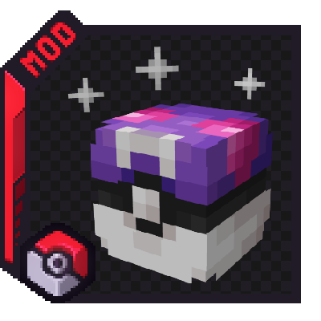

# Welcome to the Cobbleloots mod Documentation
{align=right}

!!!warning "Work in Progress"
    This documentation is currently a work in progress. Some sections may be incomplete or missing, or may contain incorrent information due to the use of artificial intelligence in its generation. If you can't find what you're looking for, please ask for help in the [Discord server](https://discord.gg/kbykWUH5dV).

The official documentation for Cobbleloots. Here you will find guides, tutorials, and references to help you understand the mod and its features.

## Getting Started
To get started with Cobbleloots, download the mod from [CurseForge](https://www.curseforge.com/minecraft/mc-mods/cobbleloots) or [Modrinth](https://modrinth.com/mod/cobbleloots) and install it using your preferred mod loader (NeoForge or Fabric).

## Features
The mod introduces the [Loot Balls](loot_balls/index.md), which are entities that can be found in the world or obtained through various means. When opened, these Loot Balls will give players random items based on predefined loot tables.