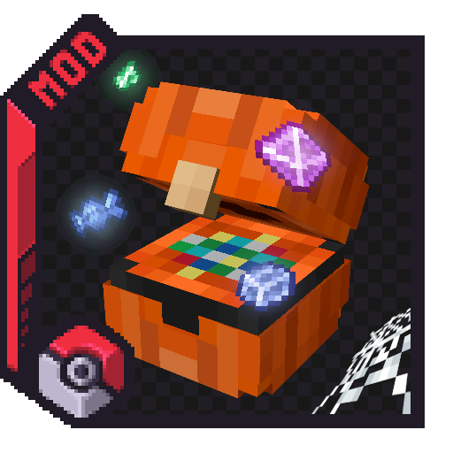

# Welcome to the Cobbleloots mod Documentation

{align=right}

The official documentation for Cobbleloots. Here you will find guides, tutorials, and references to help you understand the mod and its features.

## Getting Started

To get started with Cobbleloots, download the mod from [CurseForge](https://www.curseforge.com/minecraft/mc-mods/cobbleloots) or [Modrinth](https://modrinth.com/mod/cobbleloots) and install it using your preferred mod loader (NeoForge or Fabric).

If you need help, you can ask in the [Discord server](https://discord.gg/kbykWUH5dV).

## Features

The mod introduces the [**Loot Balls**](loot_balls/index.md), which are entities that can be found in the world or obtained through various means. When opened, these Loot Balls will give players random items based on predefined loot tables. There are **22 loot balls** across four tiers:

- :material-circle-outline: **Common** — Poké, Citrine, Verdant, Azure, Roseate, Slate, and Premier.
- :material-circle-half-full: **Uncommon** — Great, Dive, Heal, Lure, Nest, Net, Pumpkin, Quick, Rainbow, Safari, and Timer.
- :material-circle-slice-6: **Rare** — Ultra, Dusk, and Luxury.
- :material-circle: **Ultra Rare** — Master.

## Guides

- :material-cog: [**Configuration**](guides/configuration.md) — All gameplay, creative, and source settings.
- :material-brain: [**Editing in Creative Mode**](guides/how-to/creative.md) — Commands, interactions, NBT reference, and mapmaking utilities.
- :material-folder: [**Making a Datapack**](guides/how-to/datapack.md) — Create custom loot balls with filters, variants, and loot tables.

## Reference

- :material-terrain: [**Biome Tags**](reference/biome_tags.md) — Custom biome tags defined by Cobbleloots.

!!!tip
    Some sections may be incomplete or missing, or may contain incorrect information due to the use of AI in its generation. If you can't find what you're looking for, please ask for help in the [Discord server](https://discord.gg/kbykWUH5dV).
