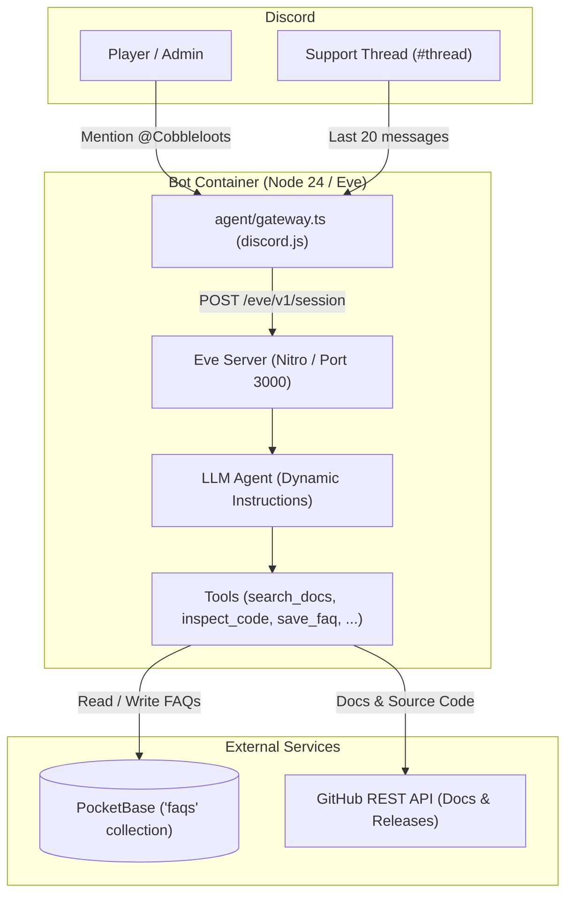

# Cobbleloots Discord AI Assistant

Autonomous community support and maintenance assistant for [Cobbleloots](https://github.com/ResistorCat/cobbleloots), built with the [Eve](https://eve.dev) framework and decoupled with [PocketBase](https://pocketbase.io).

---

## Architecture



- **Thread Context Engine**: Ingests up to 20 chronological messages when mentioned inside Discord support threads to preserve context.
- **Bilingual Support**: Answers in English by default for the global community, or in natural Spanish if addressed in Spanish.
- **Decoupled Persistence**: FAQs are stored in an external PocketBase instance, manageable via web admin UI at `/_/` or directly from Discord by authorized administrators.

---

## Environment Variables

Create a `.env` file in `infra/discord-bot` by copying `.env.example`:

| Variable | Required | Default | Description |
| :--- | :---: | :---: | :--- |
| `DISCORD_APPLICATION_ID` | **Yes** | — | Discord Application ID from the Developer Portal. |
| `DISCORD_BOT_TOKEN` | **Yes** | — | Discord Bot Token (with Message Content Intent enabled). |
| `DISCORD_PUBLIC_KEY` | **Yes** | — | Public Key for HTTP interaction signature verification. |
| `DISCORD_ADMIN_IDS` | No | `""` | Comma-separated Discord user snowflakes with administrator permissions. |
| `POCKETBASE_URL` | **Yes** | — | Base URL of PocketBase (e.g. `http://pocketbase:8090` or `https://pb.yourdomain.com`). |
| `POCKETBASE_ADMIN_EMAIL` | **Yes** | — | PocketBase administrator email. |
| `POCKETBASE_ADMIN_PASSWORD` | **Yes** | — | PocketBase administrator password. |
| `DEFAULT_MODEL` | No | `mistral/mistral-nemo` | Configured LLM model string (routed via Vercel AI Gateway). |
| `AI_GATEWAY_API_KEY` | **Yes** | — | Vercel AI Gateway API key used to authenticate model requests. |
| `GITHUB_REPO` | No | `ResistorCat/cobbleloots` | Target repository for remote release and code lookups. |
| `GITHUB_TOKEN` | No | — | Optional GitHub token to prevent API rate-limiting in production. |

---

## Local Development

```bash
# 1. Install dependencies
pnpm install

# 2. Run unit tests
pnpm test

# 3. TypeScript typecheck
pnpm run typecheck

# 4. Live development server (hot reload)
pnpm run dev

# 5. Production build and start
pnpm run build
pnpm run start
```

---

## Deployment with Coolify v4

Deploy the bot in Coolify as two decoupled services:

### 1. PocketBase Service
1. Create a new service in Coolify using the **PocketBase** template (or docker image `ghcr.io/muchobien/pocketbase:latest`).
2. Attach a persistent volume mounted at `/pb_data`.
3. Assign a public domain or connect via Coolify internal Docker network (e.g. `http://pocketbase:8090`).
4. Access `https://<pocketbase-domain>/_/` to register the initial admin account.

### 2. Discord Bot Service
1. Create a new application in Coolify pointing to the GitHub repository:
   - **Build Pack**: `Dockerfile`
   - **Base Directory**: `infra/discord-bot`
   - **Port**: `3000`
2. Add the environment variables from the table above in the Coolify environment settings.
3. Deploy. The service builds using `node:24-slim` and `pnpm`, running unprivileged under user `node`.

---

## Admin FAQ Management via Discord

Users listed in `DISCORD_ADMIN_IDS` can manage FAQs conversationally by mentioning the bot:

- **List FAQs**: `@Cobbleloots Assistant list faqs`
- **View details**: `@Cobbleloots Assistant get faq <id>`
- **Create / Update**: `@Cobbleloots Assistant save faq question: ... answer: ... category: ...`
- **Delete**: `@Cobbleloots Assistant delete faq <id>` *(requires interactive confirmation to prevent accidental deletions)*.
