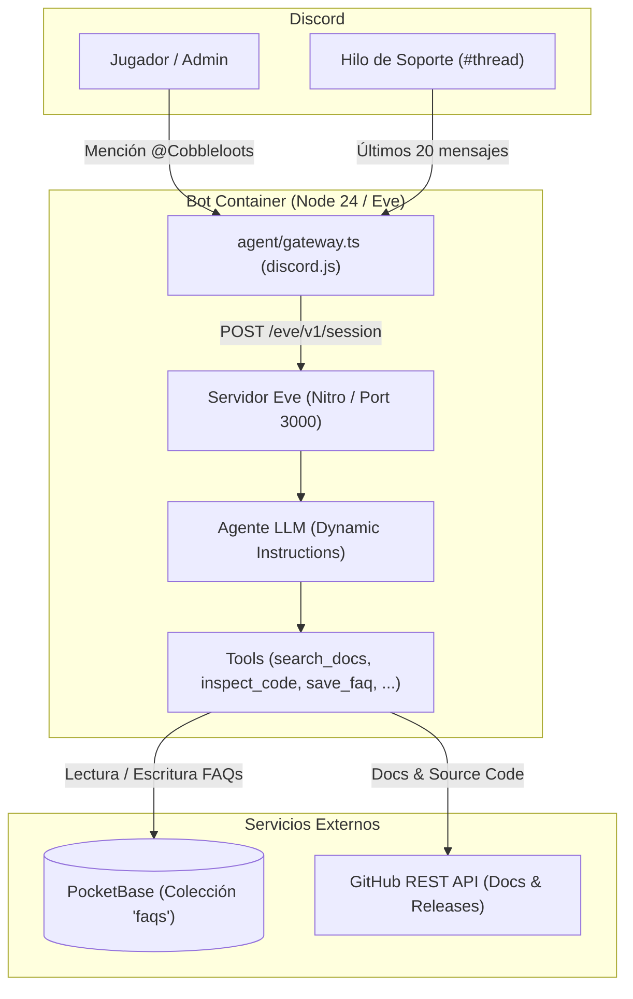

# Cobbleloots Discord AI Assistant

Bot de soporte técnico y ayuda comunitaria para la comunidad de [Cobbleloots](https://github.com/ResistorCat/cobbleloots), construido con el framework [Eve](https://eve.dev) y desacoplado con [PocketBase](https://pocketbase.io).

---

## Arquitectura



- **Thread Context Engine**: Al ser invocado en hilos de soporte, ingiere cronológicamente los últimos 20 mensajes para contextualizar la consulta.
- **Bilingüe**: Responde en inglés por defecto para la comunidad global, o en español si el usuario interactúa en español.
- **Persistencia Desacoplada**: FAQs almacenadas en PocketBase, administrables vía web en `/_/` o desde Discord por moderadores autorizados.

---

## Variables de Entorno

Crear archivo `.env` en `infra/discord-bot` a partir de `.env.example`:

| Variable | Requerido | Default | Descripción |
| :--- | :---: | :---: | :--- |
| `DISCORD_APPLICATION_ID` | **Sí** | — | ID de la aplicación en Discord Developer Portal. |
| `DISCORD_BOT_TOKEN` | **Sí** | — | Token del bot de Discord (con Message Content Intent activo). |
| `DISCORD_PUBLIC_KEY` | **Sí** | — | Clave pública para verificación de HTTP Interactions. |
| `DISCORD_ADMIN_IDS` | No | `""` | IDs de usuario (snowflakes) de Discord con permisos de administración, separados por coma. |
| `POCKETBASE_URL` | **Sí** | — | URL base de PocketBase (ej. `http://pocketbase:8090` o `https://pb.tudominio.com`). |
| `POCKETBASE_ADMIN_EMAIL` | **Sí** | — | Email de la cuenta admin de PocketBase. |
| `POCKETBASE_ADMIN_PASSWORD` | **Sí** | — | Contraseña de la cuenta admin de PocketBase. |
| `DEFAULT_MODEL` | No | `mistral/mistral-nemo` | Modelo LLM configurado (enrutado vía Vercel AI Gateway). |
| `AI_GATEWAY_API_KEY` | **Sí** | — | Clave de API de Vercel AI Gateway para autenticar las peticiones al modelo. |
| `GITHUB_REPO` | No | `ResistorCat/cobbleloots` | Repositorio para consultas remotas de código y releases. |
| `GITHUB_TOKEN` | No | — | Token opcional de GitHub para evitar límites de tasa en la API pública. |

---

## Desarrollo Local

```bash
# 1. Instalar dependencias
pnpm install

# 2. Ejecutar tests unitarios
pnpm test

# 3. Verificación de tipos TypeScript
pnpm run typecheck

# 4. Servidor de desarrollo en vivo (hot reload)
pnpm run dev

# 5. Compilación y arranque en producción
pnpm run build
pnpm run start
```

---

## Despliegue en Coolify v4

El bot se despliega en Coolify como dos servicios desacoplados:

### 1. Servicio PocketBase
1. Crear nuevo servicio en Coolify usando la plantilla **PocketBase** (o imagen `ghcr.io/muchobien/pocketbase:latest`).
2. Configurar volumen persistente en `/pb_data`.
3. Asignar dominio o usar la red interna de Docker (ej. `http://pocketbase:8090`).
4. Ingresar al panel `/_/` para registrar la cuenta de administrador.

### 2. Servicio Discord Bot
1. Crear nueva aplicación en Coolify apuntando al repositorio de GitHub:
   - **Build Pack**: `Dockerfile`
   - **Base Directory**: `infra/discord-bot`
   - **Port**: `3000`
2. Configurar las variables de entorno de la tabla anterior.
3. Desplegar. El servicio compilará con `node:24-slim` y `pnpm`, ejecutándose bajo el usuario `node`.

---

## Gestión de FAQs en Discord (Comandos Admin)

Los usuarios incluidos en `DISCORD_ADMIN_IDS` pueden gestionar FAQs directamente mencionando al bot:

- **Listar FAQs**: `@Cobbleloots Assistant list faqs`
- **Ver detalle**: `@Cobbleloots Assistant get faq <id>`
- **Crear/Editar**: `@Cobbleloots Assistant save faq question: ... answer: ... category: ...`
- **Eliminar**: `@Cobbleloots Assistant delete faq <id>` *(requiere confirmación interactiva para prevenir borrados accidentales)*.
