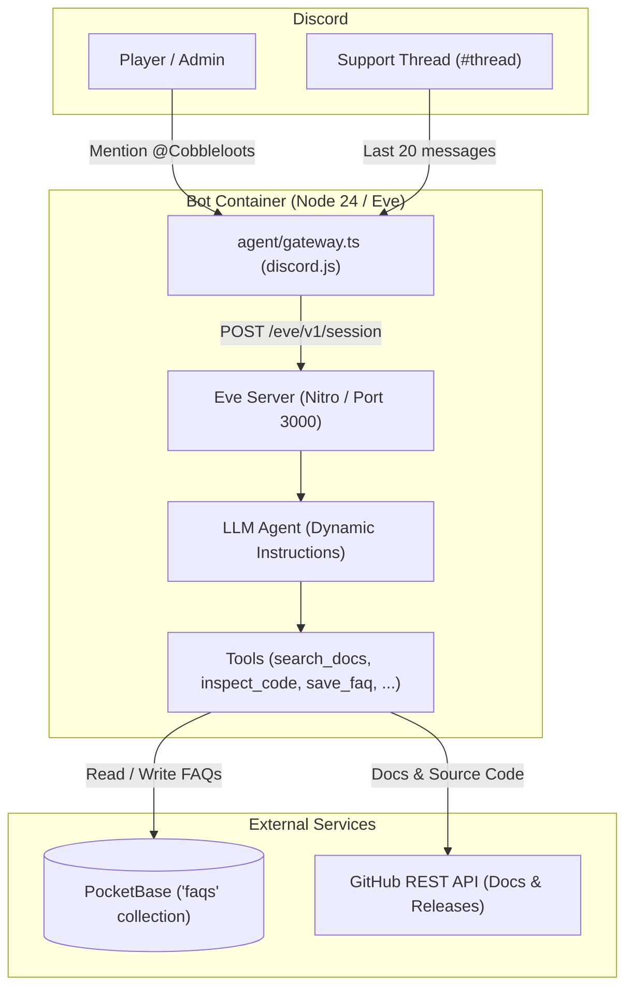

# Cobbleloots Discord Assistant

Discord support assistant for [Cobbleloots](https://github.com/ResistorCat/cobbleloots).

---

## Architecture



### Components

- **Gateway (`agent/gateway.ts`)**: WebSocket listener (`discord.js`) handling mentions and thread messages. Forwards message history (up to 20 messages in threads) to the local Eve server.
- **Agent (`agent/agent.ts`, `agent/instructions.ts`)**: Eve agent with dynamic instructions. Adapts response language to match user input (defaults to English) and keeps technical identifiers untranslated.
- **Grounding Tools (`agent/tools/`)**:
  - `search_docs`: Queries documentation index.
  - `inspect_code`: Reads source files from allowed directories.
  - `get_releases`: Fetches release notes from GitHub.
  - `search_faqs`: Searches published FAQs.
  - `list_faqs`, `get_faq`, `save_faq`, `delete_faq`: Manage FAQs in PocketBase (admin restricted).
  - `ask_question`: Clarification tool for ambiguous bug reports.
- **Storage**: PocketBase instance hosting the `faqs` collection.

---

## Environment Variables

| Variable | Required | Default | Description |
| :--- | :---: | :---: | :--- |
| `DISCORD_APPLICATION_ID` | Yes | — | Discord Application ID. |
| `DISCORD_BOT_TOKEN` | Yes | — | Discord Bot Token (Message Content Intent enabled). |
| `DISCORD_PUBLIC_KEY` | Yes | — | Public Key for HTTP interaction verification. |
| `DISCORD_ADMIN_IDS` | No | `""` | Comma-separated Discord user IDs with admin privileges. |
| `POCKETBASE_URL` | Yes | — | PocketBase endpoint URL. |
| `POCKETBASE_ADMIN_EMAIL` | Yes | — | PocketBase admin email. |
| `POCKETBASE_ADMIN_PASSWORD` | Yes | — | PocketBase admin password. |
| `DEFAULT_MODEL` | No | `mistral/mistral-nemo` | Model ID routed through AI Gateway. |
| `AI_GATEWAY_API_KEY` | Yes | — | Vercel AI Gateway API key. |
| `GITHUB_REPO` | No | `ResistorCat/cobbleloots` | Target repository for code and release queries. |
| `GITHUB_TOKEN` | No | — | Optional GitHub API token. |

---

## Local Development

```bash
# Install dependencies
pnpm install

# Run unit tests
pnpm test

# Typecheck
pnpm run typecheck

# Start development server
pnpm run dev

# Build and start production bundle
pnpm run build
pnpm run start
```

---

## Deployment (Coolify v4)

### 1. PocketBase
1. Deploy PocketBase using the Coolify template or `ghcr.io/muchobien/pocketbase:latest`.
2. Mount persistent storage at `/pb_data`.
3. Set up the admin account at `/_/`.

### 2. Bot Service
1. Create a service in Coolify using `Dockerfile` build pack:
   - **Base Directory**: `infra/discord-bot`
   - **Port**: `3000`
2. Set the environment variables listed above.
3. Deploy.

---

## Admin FAQ Commands

Users in `DISCORD_ADMIN_IDS` can manage FAQs via Discord mentions:

- `list faqs`: Lists stored FAQs.
- `get faq <id>`: Displays a specific FAQ.
- `save faq question: <q> answer: <a> category: <c>`: Creates or updates an FAQ.
- `delete faq <id>`: Deletes an FAQ (gated by Eve runtime approval with interactive Discord `[Approve]` / `[Cancel]` buttons).
